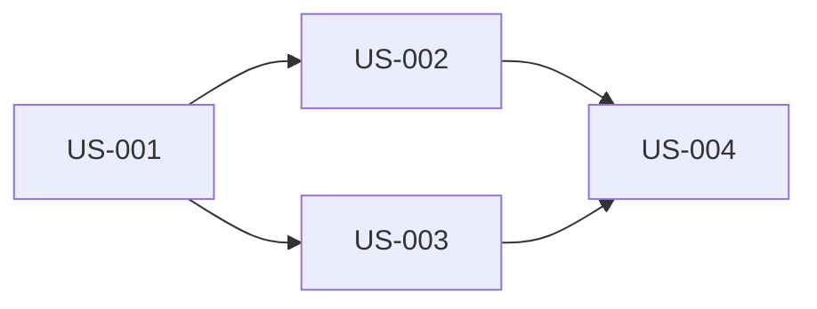

# PRD Generator

Create detailed Product Requirements Documents optimized for both human developers and AI coding agents.

---

## The Job

1. Receive a feature description from the user
2. Ask 3-5 essential clarifying questions (with lettered options)
3. Generate a structured PRD based on answers
4. Save to `tasks/prd-[feature-name].md`

**Important:** Do NOT start implementing. Just create the PRD.

---

## Step 1: Clarifying Questions

Ask only critical questions where the initial prompt is ambiguous. Focus on:

- **Problem/Goal:** What problem does this solve?
- **Core Functionality:** What are the key actions?
- **Scope/Boundaries:** What should it NOT do?
- **Success Criteria:** How do we know it's done?
- **AI Autonomy:** What decisions can the agent make independently?

### Format Questions Like This:

```
1. What is the primary goal of this feature?
   A. Improve user onboarding experience
   B. Increase user retention
   C. Reduce support burden
   D. Other: [please specify]

2. Who is the target user?
   A. New users only
   B. Existing users only
   C. All users
   D. Admin users only

3. What is the scope?
   A. Minimal viable version
   B. Full-featured implementation
   C. Just the backend/API
   D. Just the UI

4. How much autonomy should the AI agent have?
   A. Full autonomy - make all implementation decisions
   B. Moderate - decide minor details, ask for major choices
   C. Conservative - ask before any non-trivial decision
```

This lets users respond with "1A, 2C, 3B, 4B" for quick iteration.

---

## Step 2: PRD Structure

Generate the PRD with these sections in order (progressive disclosure):

### 1. Context
Brief background on WHY this feature exists and its relationship to the broader product. Front-load critical information the AI agent needs to understand the domain.

### 2. Objective
Single, clear statement of the primary goal. One sentence if possible.

### 3. User Stories
Each story needs:
- **ID:** Sequential identifier (US-001, US-002...)
- **Title:** Short descriptive name
- **Description:** "As a [user], I want [feature] so that [benefit]"
- **Acceptance Criteria:** Verifiable checklist of what "done" means
- **Priority:** `must` | `should` | `could`

Each story should be small enough to implement in one focused session.

**Format:**
```markdown
### US-001: [Title]
**Priority:** must
**Description:** As a [user], I want [feature] so that [benefit].

**Acceptance Criteria:**
- [ ] Specific verifiable criterion
- [ ] Another criterion
- [ ] Typecheck/lint passes
- [ ] **[UI stories only]** Verify in browser using browser tools
```

**Important:** 
- Acceptance criteria must be verifiable, not vague. "Works correctly" is bad. "Button shows confirmation dialog before deleting" is good.
- **For any story with UI changes:** Always include "Verify in browser using browser tools" as acceptance criteria.

### 4. Functional Requirements
Numbered list with priority levels:

```markdown
| ID   | Requirement                                    | Priority |
|------|------------------------------------------------|----------|
| FR-1 | The system must allow users to...              | must     |
| FR-2 | When a user clicks X, the system should...     | should   |
| FR-3 | The system could provide keyboard shortcuts... | could    |
```

Be explicit and unambiguous. No vague language.

### 5. Examples
**Critical for AI consumption.** Provide concrete input/output pairs showing expected behavior.

```markdown
## Examples

### Example 1: [Scenario Name]
**Input:**
- User clicks "Add Task" button
- Enters title: "Buy groceries"
- Leaves priority as default

**Expected Output:**
- New task appears in list with title "Buy groceries"
- Priority badge shows "medium" (yellow)
- Task is persisted to database

### Example 2: [Edge Case]
**Input:**
- User attempts to save task with empty title

**Expected Output:**
- Validation error appears: "Title is required"
- Task is NOT saved
- Focus returns to title field
```

Include at least 2-3 examples covering:
- Happy path (normal usage)
- Edge case (boundary conditions)
- Error case (invalid input)

### 6. Dependencies
Explicit ordering for task sequencing. What must be completed before what?

```markdown
## Dependencies



| Story  | Depends On | Reason                                    |
|--------|------------|-------------------------------------------|
| US-002 | US-001     | Cannot display priority without DB field  |
| US-003 | US-001     | Cannot edit priority without DB field     |
| US-004 | US-002     | Filter requires priority to be visible    |
```

### 7. Constraints
Technical and business limitations that restrict implementation choices.

```markdown
## Constraints

- **Technical:** Must use existing badge component (no new UI library)
- **Technical:** Database migration must be backwards-compatible
- **Business:** Must ship by end of sprint (5 days)
- **Performance:** List must render 1000+ tasks without lag
```

### 8. Non-Goals (Out of Scope)
What this feature will NOT include. Critical for managing scope and preventing AI agents from over-implementing.

### 9. AI Agent Boundaries
Explicit guidance on what the AI agent CAN and CANNOT decide autonomously.

```markdown
## AI Agent Boundaries

### Agent CAN Decide:
- Variable and function naming conventions
- Internal code organization within files
- Choice of specific utility functions
- Test case organization

### Agent MUST ASK:
- New dependencies or packages
- Changes to existing API contracts
- Database schema modifications beyond spec
- UI/UX deviations from requirements

### Agent CANNOT:
- Skip any acceptance criteria
- Modify unrelated code without permission
- Delete existing tests
- Change authentication/authorization logic
```

### 10. Technical Considerations
- Known constraints or dependencies
- Integration points with existing systems
- Performance requirements (with specific numbers)
- Relevant existing code to reference

### 11. Success Metrics
**Must be testable**, not aspirational.

Bad: "Users find it easier to manage tasks"
Good: "Task priority can be changed in ≤2 clicks from task list view"

```markdown
## Success Metrics

| Metric                              | Target        | How to Verify                |
|-------------------------------------|---------------|------------------------------|
| Clicks to change priority           | ≤ 2           | Manual testing               |
| Filter response time                | < 100ms       | Performance test             |
| Priority visible without scrolling  | 100% of tasks | Visual inspection            |
```

### 12. Open Questions
Remaining questions or areas needing clarification before implementation.

---

## Writing for AI Agents

The PRD reader may be an AI coding agent. Therefore:

1. **Be explicit and unambiguous** - Eliminate vague language entirely
2. **Avoid assumed context** - Don't reference "the other feature" without explanation
3. **Provide examples** - Concrete input/output pairs, not abstract descriptions
4. **Number everything** - Requirements, stories, constraints for easy reference
5. **Use consistent formatting** - Same structure throughout for pattern recognition
6. **Specify boundaries** - What the agent CAN and CANNOT decide
7. **Include verification steps** - How to confirm each requirement is met

---

## Output

- **Format:** Markdown (`.md`)
- **Location:** `tasks/`
- **Filename:** `prd-[feature-name].md` (kebab-case)

---

## Example PRD

```markdown
# PRD: Task Priority System

## Context

Our task management app currently treats all tasks equally. Users have requested the ability to mark certain tasks as more important. This feature will add priority levels to help users focus on what matters most.

Related: Tasks are displayed in `src/components/TaskList.tsx` and stored in the `tasks` table.

## Objective

Enable users to assign, view, and filter tasks by priority level (high/medium/low).

## User Stories

### US-001: Add priority field to database
**Priority:** must
**Description:** As a developer, I need to store task priority so it persists across sessions.

**Acceptance Criteria:**
- [ ] Add priority column to tasks table: 'high' | 'medium' | 'low' (default 'medium')
- [ ] Generate and run migration successfully
- [ ] Existing tasks default to 'medium' priority
- [ ] Typecheck passes

### US-002: Display priority indicator on task cards
**Priority:** must
**Description:** As a user, I want to see task priority at a glance so I know what needs attention first.

**Acceptance Criteria:**
- [ ] Each task card shows colored priority badge (red=high, yellow=medium, gray=low)
- [ ] Priority visible without hovering or clicking
- [ ] Badge uses existing `Badge` component from `src/components/ui`
- [ ] Typecheck passes
- [ ] Verify in browser using browser tools

### US-003: Add priority selector to task edit
**Priority:** must
**Description:** As a user, I want to change a task's priority when editing it.

**Acceptance Criteria:**
- [ ] Priority dropdown in task edit modal
- [ ] Shows current priority as selected
- [ ] Saves on modal submit (not immediately on change)
- [ ] Typecheck passes
- [ ] Verify in browser using browser tools

### US-004: Filter tasks by priority
**Priority:** should
**Description:** As a user, I want to filter the task list to see only high-priority items when I'm focused.

**Acceptance Criteria:**
- [ ] Filter dropdown with options: All | High | Medium | Low
- [ ] Filter persists in URL params (?priority=high)
- [ ] Empty state message when no tasks match filter
- [ ] Typecheck passes
- [ ] Verify in browser using browser tools

## Functional Requirements

| ID   | Requirement                                                      | Priority |
|------|------------------------------------------------------------------|----------|
| FR-1 | Add `priority` field to tasks table ('high'|'medium'|'low')     | must     |
| FR-2 | Default priority is 'medium' for new and existing tasks         | must     |
| FR-3 | Display colored priority badge on each task card                | must     |
| FR-4 | Include priority selector in task edit modal                    | must     |
| FR-5 | Add priority filter dropdown to task list header                | should   |
| FR-6 | Persist filter selection in URL params                          | should   |
| FR-7 | Sort by priority within each status column (high → low)         | could    |

## Examples

### Example 1: Creating a high-priority task
**Input:**
- User clicks "Add Task"
- Enters title: "Fix production bug"
- Selects priority: "High"
- Clicks "Save"

**Expected Output:**
- Task appears in list with red "High" badge
- Task is saved to database with priority='high'
- Task list does not re-sort (maintains creation order)

### Example 2: Filtering to high priority only
**Input:**
- Task list contains: 2 high, 5 medium, 3 low priority tasks
- User selects "High" from priority filter dropdown

**Expected Output:**
- Only 2 high-priority tasks are visible
- URL updates to include `?priority=high`
- Filter dropdown shows "High" as selected
- Count indicator shows "2 tasks"

### Example 3: Empty filter results
**Input:**
- No tasks have "Low" priority
- User selects "Low" from filter

**Expected Output:**
- Empty state: "No low-priority tasks found"
- Clear filter button visible
- Task count shows "0 tasks"

## Dependencies

| Story  | Depends On | Reason                                   |
|--------|------------|------------------------------------------|
| US-002 | US-001     | Cannot display priority without DB field |
| US-003 | US-001     | Cannot edit priority without DB field    |
| US-004 | US-002     | Filter requires priority to be visible   |

Suggested implementation order: US-001 → US-002 → US-003 → US-004

## Constraints

- **Technical:** Must use existing `Badge` component from design system
- **Technical:** Migration must handle existing tasks (default to 'medium')
- **Performance:** Filter must work client-side for <100 tasks, server-side for more
- **Browser:** Must work in Chrome, Firefox, Safari (latest versions)

## Non-Goals

- No priority-based notifications or reminders
- No automatic priority assignment based on due date
- No priority inheritance for subtasks
- No keyboard shortcuts for priority changes (future consideration)
- No drag-and-drop priority reordering

## AI Agent Boundaries

### Agent CAN Decide:
- Exact color shades for priority badges (within red/yellow/gray family)
- Internal state management approach
- Test file organization
- Utility function naming

### Agent MUST ASK:
- Adding new npm packages
- Changing the task API response shape
- Modifying existing component props
- Any changes outside `src/components/Task*` and `src/db/migrations`

### Agent CANNOT:
- Skip browser verification for UI stories
- Modify authentication logic
- Change existing test assertions
- Remove any existing functionality

## Technical Considerations

- Reuse existing `Badge` component: `src/components/ui/Badge.tsx`
- Filter state managed via URL search params (use `useSearchParams`)
- Priority stored in database, not computed
- Existing task API: `GET /api/tasks`, `PATCH /api/tasks/:id`

## Success Metrics

| Metric                             | Target    | How to Verify            |
|------------------------------------|-----------|--------------------------|
| Clicks to change priority          | ≤ 2       | Manual test              |
| Priority badge visible on card     | 100%      | Visual inspection        |
| Filter applies without page reload | Yes       | Manual test              |
| Migration runs without data loss   | 0 errors  | Migration log            |

## Open Questions

1. Should priority affect task ordering within a column? (Decided: No, for v1)
2. Should we add keyboard shortcuts for priority changes? (Deferred to v2)
3. What happens to priority when a task is duplicated? (Need PM input)
```

---

## Checklist

Before saving the PRD:

- [ ] Asked clarifying questions with lettered options
- [ ] Incorporated user's answers
- [ ] Context section explains the "why"
- [ ] Single clear objective statement
- [ ] User stories are small and have priority levels
- [ ] Functional requirements are numbered with priorities
- [ ] Examples section has happy path, edge case, and error case
- [ ] Dependencies are mapped between stories
- [ ] Constraints are explicit
- [ ] Non-goals section defines clear boundaries
- [ ] AI Agent Boundaries section specifies autonomy limits
- [ ] Success metrics are testable, not aspirational
- [ ] Saved to `tasks/prd-[feature-name].md`
